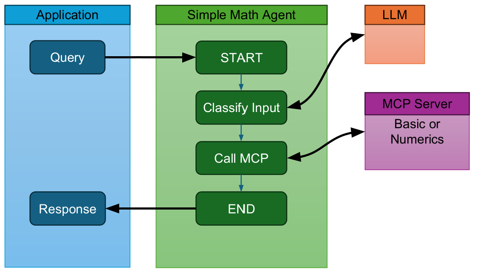

# ➕➖✖️➗ Simple Math Agent

## 🚀 Usage

Make sure the MCP servers are running before starting the agent.

Requires following env vars:
- GOOGLE_API_KEY
- BASIC_MATH_SERVER_URL
- NUMERICS_MATH_SERVER_URL
- BASIC_MATH_SERVER_SESSION_ID (run `client.py` in mcp-server to get this value)
- NUMERICS_MATH_SERVER_SESSION_ID (run `client.py` in mcp-server to get this value)

Set the env var in `.env` file (follow `.env.template` file)
```
uv add python-dotenv langgraph "langchain[google-genai]" ipykernel
uv run python main.py
```

## 🏗️ Architecture



## ✨Example

### Agent using basic-math MCP server to compute result. 💡


### Agent using numerics-math MCP server to compute result. 💡

