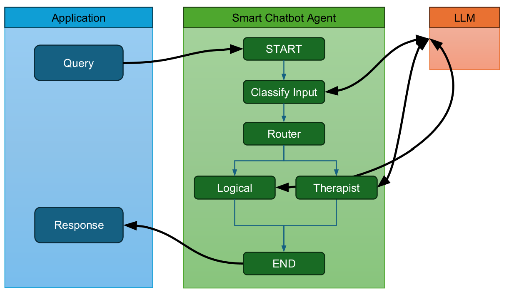

# 🤖 Smart Chatbot

## 🛠️ Usage

Requires `GOOGLE_API_KEY`. Set the env var in `.env` file (follow `.env.template` file)
```
uv add python-dotenv langgraph "langchain[google-genai]" ipykernel
uv run python main.py
```

### 🏗️ Architecture



### ✨ Example

