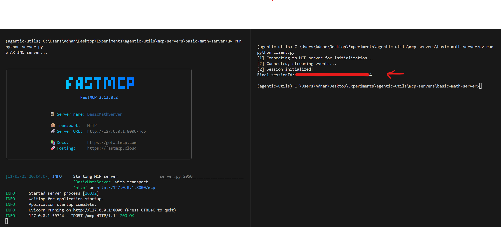
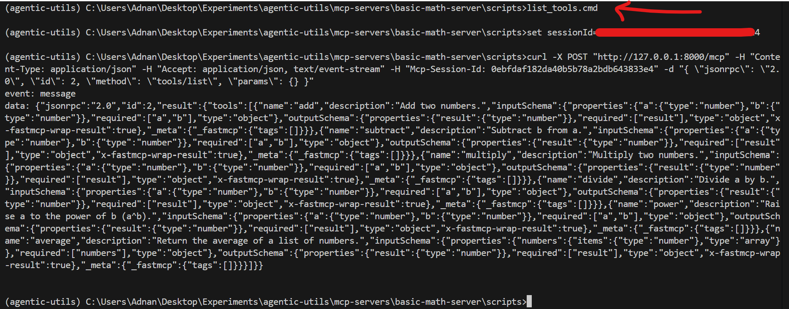
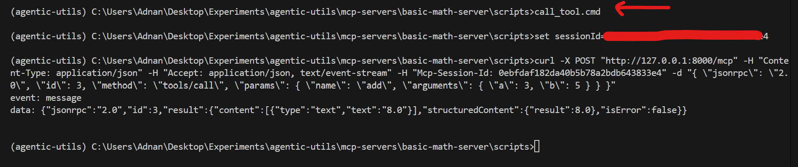

# 🧮 Basic Math MCP Server

Provides simple arithmetic tools such as `add`, `subtract`.

## 🚀 How to run the server?
```
uv add fastmcp
uv run python server.py
```

## 💻 How to run the client?
```
uv run python client.py
```



## 🧪 Check the MCP server

### 📋 List tools (Set the `session_id` in the `scripts\list_tools.cmd` file)



### 📞 Call tool (Set the `session_id` in the `scripts\call_tool.cmd` file)

